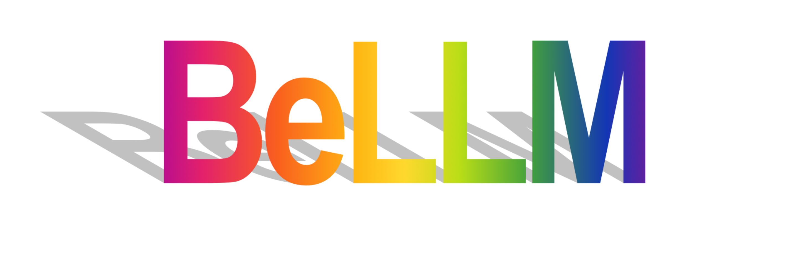

> BeLLM is a flow-matching-based LLM model

```shell
python3 src/bellm/cli train foundation-model \
  --dataset.path="hi" \
  --model.tokeniser="src/bellm/tokeniser/tokeniser.json" \
  --save-config="config.json"
```

# Tokeniser
Run the `bellm.tokeniser.tokenisation_trainer.py` to train the tokeniser.  
Run the `bellm.tokeniser.tokeniser_pruner.py` to prune the tokeniser to get only the best more frequent tokens.

Due to the way tokens are taken in batches during tokenisation, some sub-optimal tokens sneak in so we need to prune them. This overall is much faster and provides near optimal results similar to just taking the top token each time. 

For belllm v1, I took the first 20k tokens and pruned down to 15k.

# API
BeLLM has an api build in for interacting with the tool. Currently, this is just for the tokeniser. In future
this will expand along with a lil webpage.

Running the api: `scripts/api.sh`. It will run at localhost:9000. You can view the docs at /docs